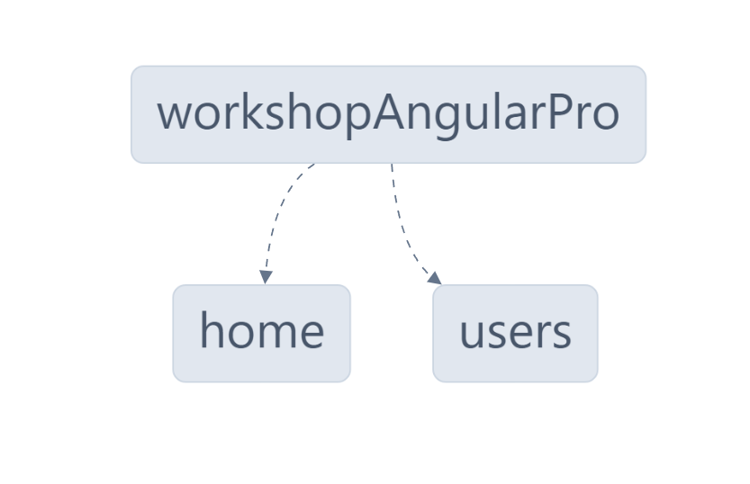

# WorkshopAngularPro

Este projeto é o resultado do evento **"Workshop Angular PRO"** ministrado por [@Andrew Rosário]("https://github.com/andrewarosario") e [@Paolo Almeida]("https://github.com/paoloalmeida"). O principal objetivo do workshop foi aprensentar, explicar e demonstrar as principais ferramentas e habilidades que um profissional Sênior em Angular deve possuir! Além do networking!

O evento foi segmentado em 3 encontros, sendos eles:

- 1º encontro (13/05): [Arquitetura escalável & Planejamento de carreira]("https://www.youtube.com/watch?v=lDkKQQTTGl4&t=8013s&ab_channel=PaoloAlmeida")
- 2º encontro (14/05): [Roteamento com RxJS e Top 3 Skills para Devs Seniores]("https://www.youtube.com/watch?v=JG7adZKQwcI&t=3547s&ab_channel=PaoloAlmeida")
- 3º encontro (15/05): [Mapa completo do Dev Angular Pro e Testes]("https://www.youtube.com/watch?v=EAoBq9Q5rvQ&t=3202s&ab_channel=PaoloAlmeida")

## Instalação

### 1º Passo

Baixe o projeto em sua máquina executando o comando:

```bash
git clone https://github.com/CleitonJB/WorkshopAngularPRO.git
```

### 2º Passo

Acesse a pasta do projeto executando o comando:
```bash
cd WorkshopAngularPRO
```

### 3º Passo

Instale as dependências do projeto com o comando:
```bash
npm i
```
ou
```bash
npm install
```

## Desenvolvimento

### 1º Passo

Execute o comando `npm run start` no terminal para executar o projeto em modo de desenvolvimento

### 2º Passo

Em seu navegador, navegue para `http://localhost:4200/`. A aplicação automaticamente será atualizada após a alteração de qualquer um dos arquivos do projeto.

## Produção

Run `ng build` to build the project. The build artifacts will be stored in the `dist/` directory.

## Executando os testes unitários

Execute o comando `ng test` para executar os testes unitários via [Karma](https://karma-runner.github.io).

## Executando os testes de ponta-a-ponta

Execute o comando `ng e2e` para executar os testes de ponta-a-ponta via [Jest](https://jestjs.io/).

## NX

Execute o comando abaixo para gerar um gráfico de dependências (módulos) do projeto:

```bash
npx nx graph
```

Resultado:



## Dependências do projeto

Abaixo, estão listadas as principais dependências/bibliotecas utilizadas neste projeto:

| Nome    | Versão  |
|---------|---------|
| Angular | 17.3.7  |
| NX      | 19.0.5  |
| Jest    | 29.4.1  |
| Node.js | 18.17.0 |
| npm     | 9.6.7   |
| GIT     | 2.45.2  |